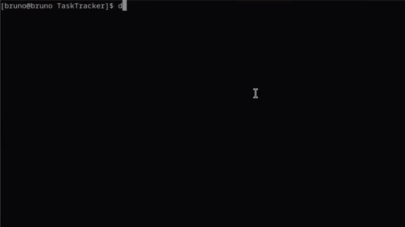

# TaskTracker: Task Manager App

## Description

TaskTracker is a CLI program 100% made in C#, that allows you to manage simple daily life tasks. The program allows you to add, remove, update or mark tasks as "done", "in progress" or "to do", after all that, you can list all tasks. Managing tasks is easier than never with a nice CLI.
This project is part of the Backend roadmap by https://roadmap.sh/projects/task-tracker.



## Features

TaskTracker has the following features:

- **Add task** - Users can add a task with a description, it will be created with the default status "todo" and receive a unique id.
- **Update task** - Users can update a task description, changing the task description to whatever they want.
- **Mark task** - Users can mark a task as "done", "in-progress" or "todo".
- **List tasks** - Users can list all tasks, or filter by status.
- **Remove task** - Users can remove a task by its id.

## Installation

Installation can be simply done by cloning the repository:
```
$ git clone https://github.com/BrunoGuimasSz/TaskTracker.git
```

## Usage

- **Add task** 
```
$ dotnet run add "buy groceries"
Task buy groceries created with success! Id 1
```
- **Update task**
```
$ dotnet run update 1 "buy groceries and fruits"
Task 1 changed from "Buy groceries" to "buy groceries and fruits"!
```
- **Mark task**
```
$ dotnet run mark-done 1
Task 1 marked as done
$ dotnet run mark-in-progress 1
Task 1 marked as in-progress
$ dotnet run mark-todo 1
Task 1 marked as todo
```
- **List tasks**
```
$ dotnet run list
 -------------------------------------------------------------------------------------------
 | Id | Description              | Status      | Created at          | Updated at          |
 -------------------------------------------------------------------------------------------
 | 1  | Buy groceries and fruits | done        | 18/03/2025 18:14:20 | 18/03/2025 18:15:41 |
 -------------------------------------------------------------------------------------------
 | 2  | Fill up the car          | todo        | 18/03/2025 18:14:56 | never               |
 -------------------------------------------------------------------------------------------
 | 3  | Fix bathroom toilet      | in-progress | 18/03/2025 18:15:08 | 18/03/2025 18:15:29 |
 -------------------------------------------------------------------------------------------
 | 4  | Visit mom                | todo        | 18/03/2025 18:15:18 | never               |
 -------------------------------------------------------------------------------------------

 Count: 4

$ dotnet run list todo
 --------------------------------------------------------------------
 | Id | Description     | Status | Created at          | Updated at |
 --------------------------------------------------------------------
 | 2  | Fill up the car | todo   | 18/03/2025 18:14:56 | never      |
 --------------------------------------------------------------------
 | 4  | Visit mom       | todo   | 18/03/2025 18:15:18 | never      |
 --------------------------------------------------------------------

 Count: 2
``` 
- **Remove task**
```
$ dotnet run remove 2
Task 2 removed with success!
```
